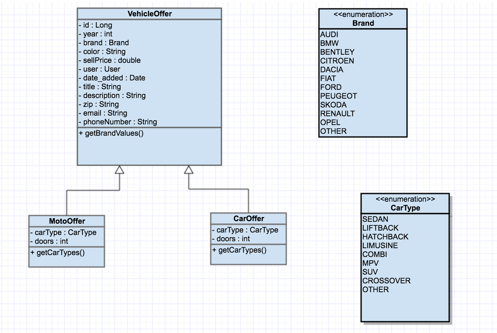

J2EE School project
===============================
Author: David Sindelar  
Openshift: http://mysupperapp-javaeeschool2.44fs.preview.openshiftapps.com/jboss-helloworld/

What is it?
-----------

School project for Advanced Java EE lab

**Task** : Car-moto bazaar

Specification?
-----------
Entiy diagram:

Task list
-----------

- Každý student si zřídí účet na github.com, zdrojové kódy projektu budou tamtéž
    > **Note:**
    > - https://github.com/dejvidecz/j2ee

- Vytvořit krátkou specifikaci - textovou či s doprovodem UML diagramů
    > **Note:**
    > - Tu právě čtete

- Implementace třívrstvé aplikace
    > **Note:**
    >- JSF - složka webapp
    >- EJB - složka src/...
    >- JPA2 - model a dao
    
- Aplikace bude používat CDI
    >**Note:**
    > - CDI se využívá na mnoha místech napr src/controller/... Oznacena anotaci @inject
    
- Aplikace bude plně zabezpečena, bude používat minimálně tři úrovně oprávnění (role)
    >**Note:**
    > - Pro generovani stranek se pouziva jsf, takze sem si udelal pro jednotliva views filtery, kde kontroluji aktualni role. V projektu se nachazeji role Administrator, Member a Guest  .. Guest je ten, kdo není přihlášen

- Datový model bude anotovaný pomocí Bean Validation - stačí použít předdefinované anotace, použití i vlastních omezení je plus
    >**Note:**
    > - viz entity
    
- Aplikace bude testovatelná (Arquillian)
    >**Note:**
    > - src/test/

- Aplikace bude nasazena v clusteru dvou uzlů v doménové konfiguraci, přiložen konfigurační skript (JBoss CLI) a demonstrována její odolnost vůči výpadku jednoho z nich (lze simulovat na jednom počítači)
    >**Note:**
    > - Nesplněno
    
- nasazená aplikace bežící v OpenShift 3 (developer preview)
    >**Note:**
    > - http://mysupperapp-javaeeschool2.44fs.preview.openshiftapps.com/jboss-helloworld/
    
- Aplikace bude vystavovat rozhraní pro komunikaci mezi systémy (JAX-RS) - formát zpráv JSON
    >**Note:**
    > - src/main/java/rest
    
- Aplikace bude používat alespoň jeden WebSocket endopint
    >**Note:**
    > src/main/java/websocket
    
- Aplikace bude volat alespoń jeden REST endpoint (JAX-RS)
    >**Note:**
    > src/main/java/resteasy/
    
- Vystavené endpointy budou podoporovat zabezpečení
    >**Note:**
    > src/main/java/webfilter
    
- Aplikace bude obsahovat alespoň jeden use case pro použití Concurrency nebo Batching API
    >**Note:**
    > src/main/java/batching
    
- Aplikace bude obsahovat alespoň jeden use case pro použití JMS 2.0 API
    >**Note:**
    > src/main/java/jms
    
   
